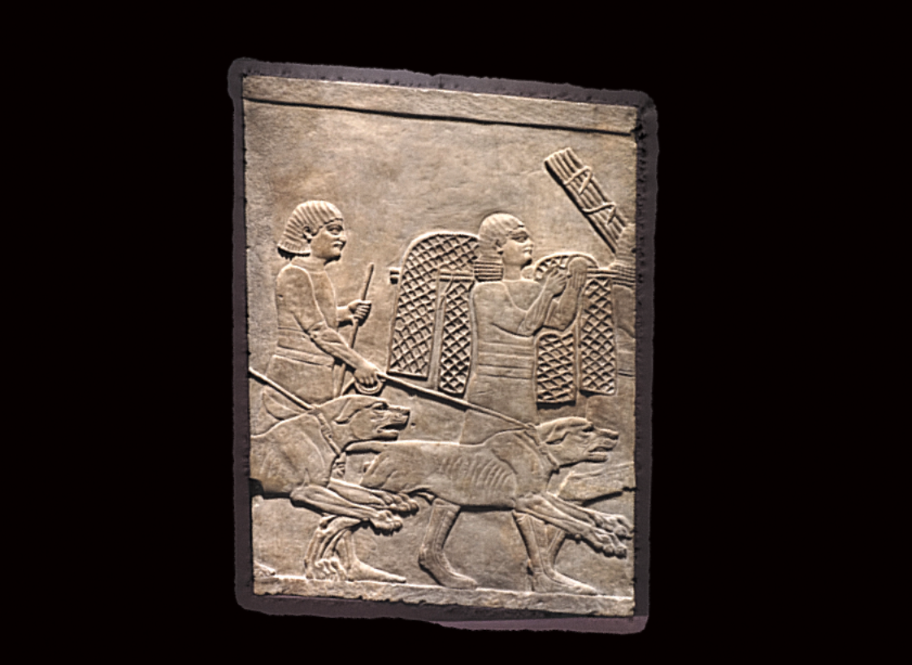

[](http://creativecommons.org/licenses/by-sa/4.0/) 
[](http://orcid.org/0000-0002-0246-2335)

# Nineveh North Palace, Room R Panel 7




This repository contains source data to recreate a 3D model from the British Museum's Assyrian collection and currently on display in the Ahurbanipal exhibition.. The file structure is as follows:

```
ladders/
├── README.md
├── LICENSE.md
├── images
├── masks
├── other
|── cameras
└── models
   |-OBJ
   |-STL
   |-PLY
```
Models are included as PLY, OBJ and STL representations. 

# Metadata 

Gypsum wall relief panel with large dogs; carved; the man or eunuch holding the lead is beardless, but his hair ends in a row of plaits, in a simpler style than that of his companion; men leading mules in this procession have similar plaits, which may have been worn by people of lower status at the Assyrian court. The Assyrian eunuch in front is carrying a net and stakes.

Height: 157 centimetres Width: 118 centimetres Thickness: 10 centimetres (extant)

38 photographs Sony A6000, processed in Photoscan pro. Currently on display in the Ashurbanipal exhibition at @britishmuseum

# LICENSE
The contents of this repository are licensed under CC-BY

# Credits

Photographs and models by Daniel Pett - 26 Huawei mobile phone. 
